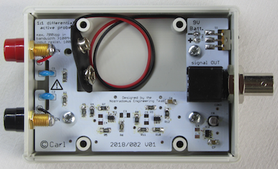
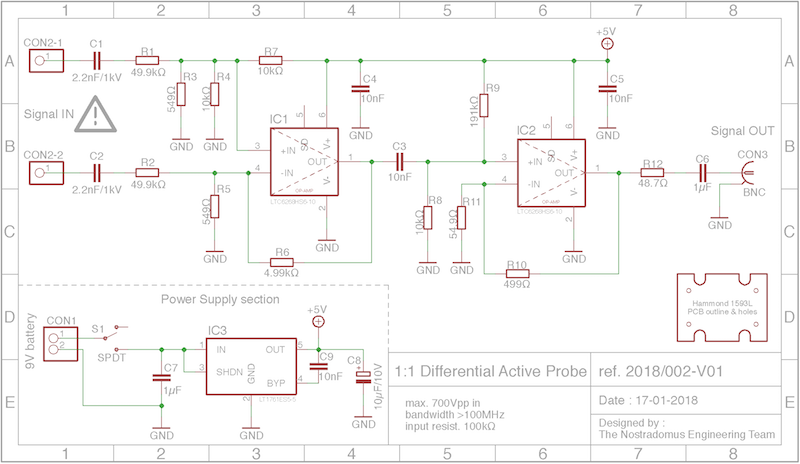

# LabTools : 100MHz+ Differential Probe

## What

This repository describes how to build your own differential oscilloscope probe. In the respective folders you can find all necessary files to have the pcb produced, drawings on how to prepare the enclosure for final built-in, and detailed datasheets  on the used components.

## Why

A couple of years ago I built a [basic differential probe, limited to 1MHz/700Vpp input signals](https://github.com/nostradomus/LabTools_1MHz-Differential-Probe). The design was entirely done with through-hole components on a single-sided pcb. As technology and material have significantly gotten better over the years, I decided to build an improved version with better [specifications](#input-specifications), based on modern SMD components.   
The below ["What is it all about"](#a-differential-probe,-what-is-it-all-about-?) section will explain why you would actually want to build a differential probe, how it works, and what it can be used for in your lab.

## How

Being the proud owner of both the [Horowitz & Hill's "The Art of Electronics"](https://artofelectronics.net) and the [Linear Technology's "Analog Circuit Design" trilogy](http://www.linear.com/designtools/acd_book.php), I started reading to find a good solution for a state-of-art roll-your-own differential oscilloscope probe. Soon I found out that Linear Technology was not only having the right components, but was also having some very enlightening application notes, almost completely covering what I needed. As the schematic for a [differential amplifier](https://en.wikipedia.org/wiki/Differential_amplifier) is very well-documented in LT's design note collection, I could start designing the pcb almost right away. However, a lot of attention was needed for the specific design constraints, as explained in the respective paragraph of the [opamp's datasheet](pdf-files/datasheet_-_LTC6268-10.pdf) on page 16. As a cherry on the cake, Linear Technology has been so kind to sample some chips for the prototype. The key components for this project concern two [LTC6268-10 4GHz FET-input operational amplifiers with extremely low input bias current and low input capacitance](pdf-files/datasheet_-_LTC6268-10.pdf), and an [LT1761 low noise, LDO micropower regulator](pdf-files/datasheet_-_LT1761.pdf). An extended [design note](pdf-files/designnotes - LT1761.pdf) concerning the LDO can be found in Analog Circuit Design Volume 3, chapter 166, or on the [LT website](http://www.linear.com/product/LT1761). More [in-depth theory](pdf-files/applicationnote_-_LT1761.pdf) on this particular LDO is also available in Analog Circuit Design Volume 1, section 3, chapter 12.

### A differential probe, what is it all about ?

...publication in progress...

### Simulation and calculations

The chip supplier for this project is also having a SPICE (Simulation Program with Integrated Circuit Emphasis) in his catalogue : [LTspice](http://www.linear.com/designtools/software/):registered:, available for both [Windows](http://ltspice.linear-tech.com/software/LTspiceXVII.exe) and [MAC OS's](http://ltspice.linear-tech.com/LTspiceIV.dmg) (free downloads). A specific demo circuit for simulation and calculations for the LTC6268-10 can be downloaded [here](http://www.linear.com/docs/47412). It concerns a file with extension ".asc" which can be opened with the LTspice:registered: software.

## Progress status

 - [x] have a [need](#why)
 - [x] define the technical [specifications](#input-specifications)
 - [x] decide on what is should [look](#how) like
 - [ ] create drawings for the [housing](#mechanical-construction)
 - [ ] [test and validate](#demo-setup-and-measurements) the concept
 - [ ] publish the [schematic and explain the electronics](#electronics)
 - [x] publish production files for the [electronics board](#printed-circuit-board) board
 - [ ] write [end-user documentation](https://github.com/nostradomus/100MHz+_Differential_Probe/wiki)

## Technical details

### Input specifications

- 1:1 active differential probe
- (over) 100MHz off bandwith
- 100kΩ input resistance
- max 700Vpp or 2500Vpp (depending on C1,C2)

### Electronics

As explained [above](#how), the heart of the circuit is based on two Linear Technology [LT6268-10](pdf-files/datasheet_-_LTC6268-10.pdf) high-frequency amplifiers, IC1/IC2, to obtain a fully differential oscilloscope probe with interesting [specifications](#input-specifications). Next, a detailed circuit description from Linear Technology, extended with component names :  
_The input stage, around IC1, is a modified differential amplifier configuration with 100:1 attenuation on the inputs to allow wide common-mode swings. Additionally, the inputs are ac-coupled, by C1/C2, to provide high-voltage dc blocking. The first-stage, IC1, re-amplifies the signal by 10:1 as does the single-ended output stage IC2, for a composite gain of 1:1. A back-termination resistor, R12, provides stability when driving a cable to the 1MΩ oscilloscope input port, and is AC-coupled, C6, to remove the 2.5V output-stage bias._   
The [LT1761 ](pdf-files/datasheet_-_LT1761.pdf) low noise LDO micropower regulator IC3 outputs a stable 5v to power the entire circuit, coming from a standard [9V block battery](pdf-files/datasheet_-_9v-alkaline.pdf).

#### Schematics

#### Printed circuit board

#### Components list

Part           | Value         | Package          | Description  
-------------- | ------------- | ---------------- | -----------  
R1             | 2k2           | 1206             | resistor
R1, R2	       | 49.9kΩ	       | 1206             | resistor
R3, R5	       | 549Ω	         | 1206             | resistor
R4, R7, R8	   | 10kΩ	         | 1206             | resistor
R6	           | 4.99kΩ	       | 1206             | resistor
R9	           | 191kΩ	       | 1206             | resistor
R10	           | 499Ω	         | 1206             | resistor
R11	           | 54.9Ω	       | 1206             | resistor
R12	           | 48.7Ω	       | 1206             | resistor
C1, C2	       | 2.2nF/1kV (1) | C050-025X075     | capacitor
C3, C4, C5, C9 | 10nF     	   | 1206             | capacitor
C6, C7	       | 1µF	         | 1206             | capacitor
C8	           | 10µF/10V	     | Panasonic type B | polarised capacitor
IC1, IC2	     | LTC6268HS6-10 | SOT95P280X100-6N | op-amp
IC3	           | LT1761ES5-5	 | SOT95P280X100-5N | LDO voltage regulator
S1	           | SPDT	         | MINI SWITCH 90   | mini toggle switch
CON1           | 9V            | soft clip        | 9V battery clip
CON2-1, CON2-1 | 4mm       (2) | banana socket    | 4mm red/black banana socket
CON3	         | BNC	         | BNC-F-90-4       | female BNC 90° (PCB)
H1             | 1593LGY       | enclosure        | Hammond 1593L enclosure

(1) 1kV or 3kV, see [building instructions](#Building-instructions)   
(2) use appropriate double isolated banana sockets for measurements on lines >48V (also see [building instructions](#Building-instructions))

#### Demo setup and measurements

...publication in progress...

### Mechanical construction

The bases for the housing is an abs handheld instrument enclosure from the [1593 series](https://www.hammfg.com/electronics/small-case/plastic/1593), fabricated by [Hammond manufacturing](https://www.hammfg.com/), more specifically [1593LGY](pdf-files/) (grey-coloured, with two removable end-plates).

 

The pcb for the probe has been designed in such a way that it can be fixed with four screws to the bottom of the enclosure. On the side of the pcb, cut-outs have been foreseen for the holes that allow to screw the bottom and top of the enclosure together. The large rectangle cut-out fits a [9V block battery](pdf-files/datasheet_-_9v-alkaline.pdf) which serves as power supply for the probe. A T-shaped groove on the input-side protects the circuitry from arcing  and creep when higher input voltages are applied (please implement all safety precautions as explained in the [electronics](#Electronics) and [building](#Building-instructions) paragraphs when working with potential differences which are higher than 48V-to-earth).

### Building instructions

The best way to populate the PCB, in case of hand-soldering, is to start with the chips IC1,IC2,IC3, as you will need access to the surroundings to remove the excess solder with some braided shielding wire. Next all 1206 package SMD components can be mounted (resistors and capacitors). Then you can also mount the aluminium capacitor C8 (look at the footprint for the correct orientation). After having finished with the SMD components, through-hole capacitors C1,C2 need to be mounted. Next, push the BNC connector's mechanical pins firmly in the pcb (the holes are very tight). Switch S1, which is soldered sideways on the component side should be positioned in order for the metal housing to be just behind the frontplate of the Hammond enclosure (for positioning, first only solder the middle pin, put the pcb in the enclosure, and slide in the frontplate to check the position). Finally, the 9V clip wires can be soldered (mind polarisation). Finish by preparing two wires (ideally using different colours), which will be connected to the two signal-input banana connectors during final mounting.

As for the incoming signal, there are several options, depending on the target application of the probe. In case the probe will only be used for low voltages (below  48V), any type of test-lead and banana socket can be used. When working with voltages above this level, appropriate sockets and test leads should be installed, and capacitors C1,C2 should be dimensioned accordingly. On the current pcb both 1kV and 3kV types will fit (both commercially available). As for the banana sockets, double isolated types should be used (see below image). Depending on the voltage to apply, you should also consider putting electrical isolation on the back of the sockets, and replace the pcb screws with nylon versions.

## Contributors

If you are having any good suggestions, just drop me a line [:email:](http://nostradomus.ddns.net/contactform.html).
If feasible, I'll be happy to implement proposed improvements.
And if you are having lots of time, I'll be happy to share the work with you ;-).

When you create your own version, don't forget to send us some nice pictures of your construction. We'll be happy to publish them in the :confetti_ball:Hall of Fame:confetti_ball:.

## :globe_with_meridians: License

At this moment, there is no specific license attached to this project yet.

So, today, if you like it, have fun with it (at your own risk of course :-D), and especially, be creative.

Oh, and when using anything from this repository, it is highly appreciated if you mention its origin.

If you would like to use any of this work (or the whole project) for commercial use, first [contact us :email:](http://nostradomus.ddns.net/contactform.html), so we can add the appropriate license, which best fits your business.
